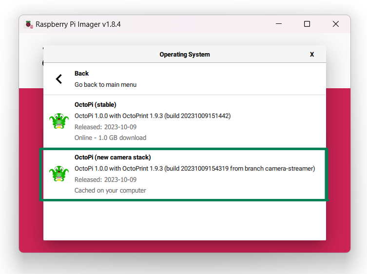
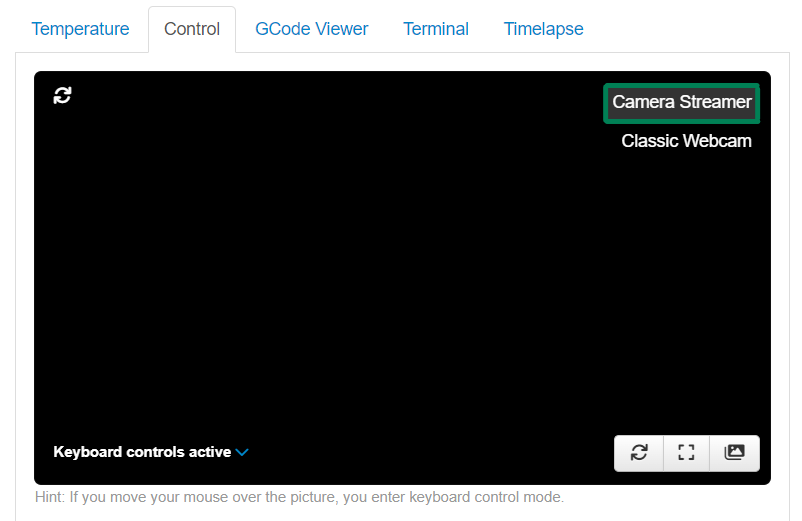
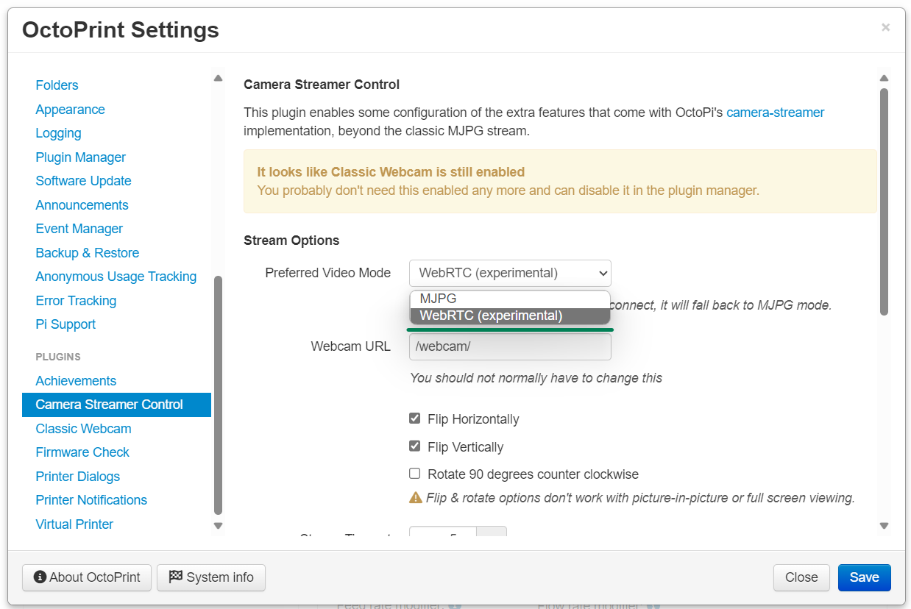

# OctoPrint Camera Streamer Control Plugin

## ⚠️ Slow maintenance ⚠️

**I have very little time to work on this & my other plugins at the moment.**

If you have an issue, please report it. If you think that you can debug & fix an issue, please
submit a PR and I will be happy to merge it. I wanted to get this plugin out so people could enjoy
the smooth streaming but my lack of time held it up. It's maintenance will need help from the community.

---

Using OctoPi's new camera stack? Add this plugin to watch your prints in shiny, fast, low bandwidth H264 glory!

## How do I use it?

First, you need to be using the recent updates to the streaming stack in OctoPi, based on camera-streamer that
Gina published a short while ago. [For info on that, see the blog post here](https://octoprint.org/blog/2023/05/24/a-new-camera-stack-for-octopi/).

You can install this image through the Raspberry Pi Imager. Follow the steps on <https://octoprint.org/download>,
but select the 'new camera stack' image:



Once that is set up and running, you'll be able to install this plugin. It can be installed by finding it
from the plugin manager or manually using this URL:

```
https://github.com/cp2004/OctoPrint-CameraStreamer-Control/archive/refs/heads/main.zip
```

Once installed, you should see your webcam stream still in the control tab,
but with a new option to switch to 'Camera Streamer':



## Enabling WebRTC streaming

camera-streamer provides a h264 encoded stream alongside the classic mjpg stream. This plugin lets you use that
to view your webcam as well! You can switch stream formats in the plugin settings:



### A note on WebRTC support

This is still an 'experimental' feature and issues will continue to be worked out. If your stream fails to connect,
the plugin will automatically fall back to the old mjpg stream, so you shouldn't see any interruption.

It is also important to note that camera-streamer uses the Pi's hardware encoders to do the heavy lifting here. On
low-powered Pi's such as the Pi Zero, you will struggle to use high resolutions and frame rates. A Pi 4 should be
capable of 1080p 30FPS streaming, but this is not guaranteed. If you find stuttering in the stream, lower the resolution
and framerate in the [streaming stack configuration](https://faq.octoprint.org/camera-streamer-config).
